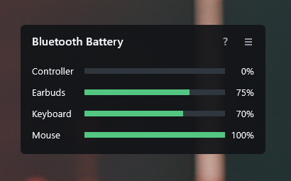

# BTBattery

BTBattery is a lightweight Rainmeter plugin for reading Bluetooth battery levels directly from Rainmeter measures.

It is built for skins that only need battery percentage values for Bluetooth devices such as keyboards, mice, earbuds, headphones, and controllers. The plugin avoids PowerShell polling, registry handoffs, Lua parsing, and external helper scripts.



## Why This Exists

Rainmeter can already run scripts, but script-based Bluetooth polling can be slow on load and can cause visible stutter when the skin updates frequently. BTBattery keeps the Rainmeter-facing measure simple:

```ini
[mKeyboardBattery]
Measure=Plugin
Plugin=BTBattery
DeviceName=CHERRY KW X ULP MINI
```

The expensive Bluetooth scan runs in the background on a shared timer. Rainmeter measure updates return the last cached value quickly.

## Features

- Returns a single numeric battery value for each measure.
- Uses the standard Windows Bluetooth battery property when available.
- Supports built-in HID report profiles for devices that do not expose a normal Windows battery property.
- Shares one background Bluetooth snapshot across all BTBattery measures in the skin.
- Logging is off by default and only enabled with `EnableLogging=1`.
- Exact device-name matching is the default.
- Optional `EnableState=1` keeps offline devices distinguishable with `-1`.
- Includes x64 and x86 DLLs for Rainmeter packaging.

## Installation

### Recommended: `.rmskin`

### Manual Install

1. Close Rainmeter.
2. Copy 32-bit or 64-bit correct DLL to Rainmeter's plugin folder:

```text
%APPDATA%\Rainmeter\Plugins\BTBattery.dll
```
3. Start Rainmeter again.
4. Refresh your skin.

## Basic Usage

```ini
[mBluetoothBattery]
Measure=Plugin
Plugin=BTBattery
DeviceName=Your Bluetooth Device Name
```

`DeviceName` should match the friendly name shown in Windows Bluetooth & devices settings.

For a simple text meter:

```ini
[BatteryText]
Meter=String
MeasureName=mBluetoothBattery
Text=%1%
```

For a bar meter:

```ini
[mBluetoothBattery]
Measure=Plugin
Plugin=BTBattery
DeviceName=Your Bluetooth Device Name
MaxValue=100

[BatteryBar]
Meter=Bar
MeasureName=mBluetoothBattery
BarOrientation=Horizontal
```

## Example Skin

The `Examples` folder contains `BTBatteryExample.ini`, a small bar-based Rainmeter skin with four editable device slots.

Edit the device names at the top of the skin:

```ini
Device1Name=DualSense Wireless Controller
Device1Label=Controller
```

## Measure Options

### `DeviceName`

Required for normal use.

```ini
DeviceName=Nothing Ear (a)
```

Use the friendly name shown by Windows Bluetooth & devices settings.

### `DeviceAddress`

Optional. Use only when two devices have the same or confusing names.

```ini
DeviceAddress=001122AABBCC
```

Write the Bluetooth address without separators.

### `MatchMode`

Optional. Defaults to `Exact`.

```ini
MatchMode=Contains
```

Available modes:

```text
Exact      Friendly name must match exactly. This is the default.
Contains   Device name may contain the configured text.
Partial    Alias for Contains.
```

Use `Contains` only when Windows exposes a longer or awkward device name. Exact matching is safer because it avoids accidentally matching the wrong device.

### `PollSeconds`

Optional. Defaults to `30`.

```ini
PollSeconds=30
```

This controls how often the shared background Bluetooth snapshot is refreshed. It is intentionally separate from Rainmeter's `Update` / `UpdateDivider` timing.

`UpdateDivider` depends on the skin update rate. For example, `UpdateDivider=30` means 30 seconds in a skin with `Update=1000`, but only 1.5 seconds in a skin with `Update=50`. `PollSeconds=30` always means 30 real seconds.

### `EnableLogging`

Optional. Logging is off when this line is omitted.

```ini
EnableLogging=1
```

Use this only while debugging. Log lines are written to Rainmeter's log.

### `EnableState`

Optional. Defaults to `0`.

```ini
EnableState=1
```

Use `EnableState=1` when your skin needs to distinguish offline / unavailable devices from an actual `0` battery reading. See [Return Values](#return-values) for the exact output behavior.

## Return Values

Default mode, with `EnableState` omitted or set to `0`:

```text
0       Offline, unavailable, not found, or actual 0 percent
1-100   Battery level percent
```

With `EnableState=1`:

```text
-1      Offline, unavailable, or not found
0-100   Battery level percent
```

When `EnableState=1` is used, the first value after loading can briefly be `-1` while the background Bluetooth snapshot is built. This avoids blocking Rainmeter's UI thread.

## Supported Devices

Most Bluetooth devices that expose the standard Windows battery property should work without a device-specific profile.

Built-in HID report profiles currently include:

| Device family | USB VID | USB PID | Notes |
| --- | --- | --- | --- |
| Sony DualSense Wireless Controller | `054C` | `0CE6`, `0DF2` | Battery level is read from HID input reports when Windows does not expose the standard Bluetooth battery property. |

Devices that hide battery data in custom HID reports require a plugin update.

## Troubleshooting

### The measure returns `0`

With default settings, `0` can mean the device is offline, unavailable, not found, or actually at 0 percent. Add this if you need to distinguish offline state:

```ini
EnableState=1
```

### The measure returns `-1`

This only happens when `EnableState=1` is used, or during initial loading before the first background snapshot is ready.

Check that:

- The device name matches Windows Bluetooth & devices settings.
- The device is paired and connected.
- The device exposes a battery value in Windows.
- `MatchMode=Contains` is used only when exact matching is not practical.

### Enable debug logging

Add this to the measure temporarily:

```ini
EnableLogging=1
```

Refresh the skin, wait one poll cycle, then check Rainmeter's log for `BTBattery:` lines.

## Requesting Device Support

If Windows shows a battery level but BTBattery does not, open a GitHub issue with:

- Device name shown in Windows.
- Bluetooth address, if known.
- Rainmeter version and architecture.
- BTBattery measure used in the skin.
- `BTBattery:` log lines with `EnableLogging=1`.
- HID report information if you can capture it.

You usually do not need to send the device physically. For standard Windows battery properties, logs are often enough. For custom HID devices, support is much easier if someone can provide HID report samples or reliable documentation.

## Release Layout

```text
Release/
  x64/BTBattery.dll
  x86/BTBattery.dll
Source/
  API/
  C++/PluginBTBattery/
  README.md
Examples/
  BTBatteryExample.ini
  README.md
```

## Building From Source

Open a Visual Studio Developer PowerShell or Developer Command Prompt, then run:

```powershell
cd Source\C++
msbuild .\PluginBTBattery\PluginBTBattery.vcxproj /p:Configuration=Release /p:Platform=x64
msbuild .\PluginBTBattery\PluginBTBattery.vcxproj /p:Configuration=Release /p:Platform=Win32
```

The source folder includes the minimum Rainmeter SDK API files needed by this project.

## Packaging Notes

Rainmeter's Skin Packager can include custom plugins and install the architecture-correct DLL. For manual GitHub releases, provide both:

```text
Release\x64\BTBattery.dll
Release\x86\BTBattery.dll
```

See `PACKAGING.md` for the package checklist.

## License

MIT License. See `LICENSE.md`.

